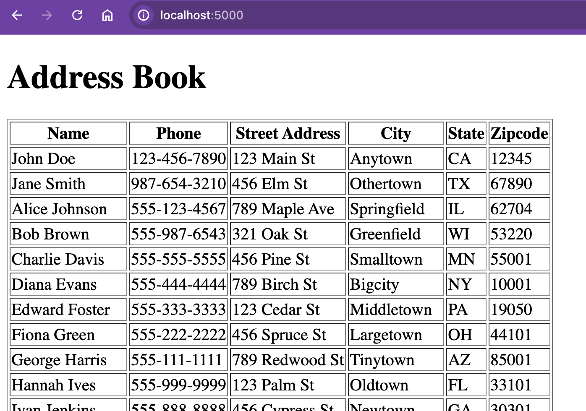
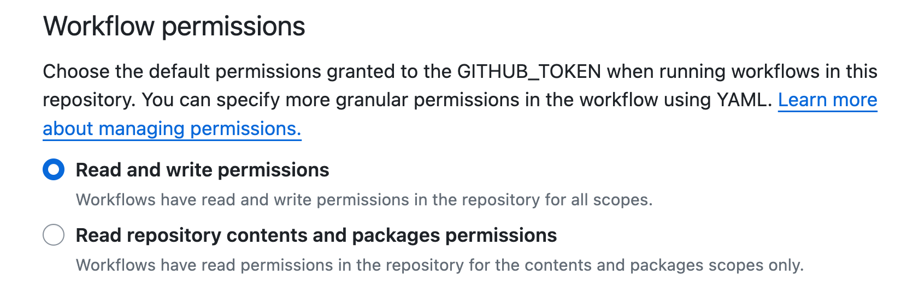

# Address Book

This is a very simple web app for testing observability tools. It can be run
using Docker Compose or Kubernetes. It reads data from a PostgreSQL database
and displays it in an HTML table



## Services

### app

A Python Flask app with one endpoint that queries a PostgreSQL table and renders
a table of contacts. It uses the `psycopg2` library to connect to the database.

### postgres

A PostgreSQL database with a table called `addresses` that has a couple
dozen rows of fake data.

### nginx

An Nginx server that proxies requests to the Flask app.

## Configuration

Copy the `env-example` file to `.env` and set the values to match your
environment.

For Kubernetes, you can create ConfigMaps and Secrets from `nginx/nginx.conf`
and `.env`. In the `deploy/kubernetes` directory:

```bash
# app config
kubectl create configmap app-config --from-env-file=../../.env
kubectl get configmap app-config -o yaml > app-config.yaml
```

## Building

### GitHub Actions

This repository includes a workflow to build the Python service image
`ghcr.io/address-book`. Pushes to main will build a new image and store it in
your GitHub Container Registry as
`ghcr.io/[github-account]/address-book:latest`. You can also run the workflow
manually to build an image from a branch or tag.

For this to work, make sure that your Actions settings allow read and write permissions for `GITHUB_TOKEN`: 

1. In your repository, go to the **Settings** tab
2. Click on **Actions > General**
3. Under **Workflow permissions**, select **Read and write permissions**:

   

4. Click **Save**

### Locally

See the `Dockerfile` in the `app` directory for building the `address-book`
image. If you build the image locally, update the `docker-compose.yml` 
as described in the next section.

## Running

Using either Docker Compose or Kubernetes, the app will be avaialble at
`http://localhost:5000`.

### Docker Compose

The `docker-compose.yml` file in the `deploy/docker` directory uses latest
public image in [`stevedatadog/address-book`](https://github.com/stevedatadog/address-book/pkgs/container/address-book). Update the file to use a local image
if you built it yourself.

In the deploy/docker directory:

#### Using the default public image

```bash
docker-compose --env-file ../../.env up
```

#### Using a locally built image

```bash
docker-compose --env-file ../../.env up --build
```

If you want to enable debug mode for the Flask app, set the `FLASK_DEBUG`:

```bash
docker-compose --env-file ../../.env -e FLASK_DEBUG=1 up
```

### Kubernetes

It's hard to run this app in Kubernetes using a local image. You would have
to add a [Docker registry](https://distribution.github.io/distribution/) to 
the cluster for pods to pull from. It's easier to build your images using the GitHub workflow.

In the `deploy/kubernetes` directory:

```bash
kubectl apply -f .
```
