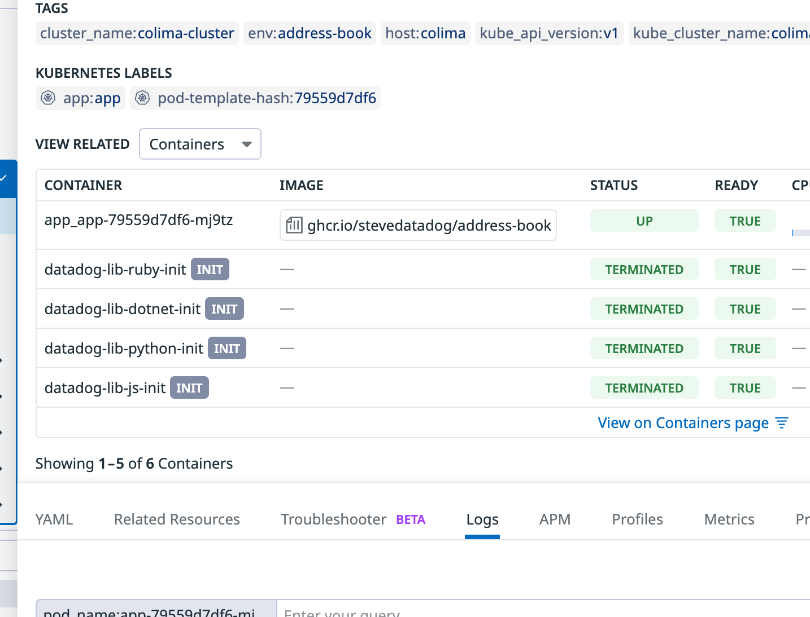

# Address Book

This is a very simple web app for testing observability tools. It can be run
using Docker Compose or Kubernetes. It reads data from a PostgreSQL database
and displays it in an HTML table


## Services

### app

A Python Flask app with one endpoint that queries a PostgreSQL table and renders
a table of contacts. It uses the `psycopg2` library to connect to the database.

### postgres

A PostgreSQL database with a table called `addresses` that has a couple
dozen rows of fake data.

### nginx

An Nginx server that proxies requests to the Flask app.

## Configuration

### Docker Compose

Copy the `env-example` file to `.env` and set the values to match your
environment.

### Kubernetes

ConfigMaps for Nginx and PostgreSQL are in the `deploy/kubernetes`
directory. You can regenerate these configmaps as follows.

Assuming you are in the `deploy/kubernetes` directory:

```bash
# nginx config
kubectl create configmap nginx-config --from-file=../../nginx/nginx.conf
kubectl get configmap nginx-config -o yaml > nginx-configmap.yaml
```

```bash
# postgres config
kubectl create configmap postgres-init-config --from-file=../../postgres/init.sql
kubectl get configmap postgres-init-config -o yaml > postgres-init-configmap.yaml
```

To create Kubernetes secrets for the cluster, run the `make-secrets.sh` script.
This will turn the sensitive contents of `/.env` into Kubernetes secrets.

## Building

### GitHub Actions

This repository includes a workflow to build the Python service image
`ghcr.io/address-book`. Pushes to main will build a new image and store it in
your GitHub Container Registry as
`ghcr.io/[github-account]/address-book:latest`. You can also run the workflow
manually to build an image from a branch or tag.

For this to work, make sure that your Actions settings allow read and write permissions for `GITHUB_TOKEN`:

1. In your repository, go to the **Settings** tab
2. Click on **Actions > General**
3. Under **Workflow permissions**, select **Read and write permissions**:

   

4. Click **Save**

### Locally

See the `Dockerfile` in the `app` directory for building the `address-book`
image. If you build the image locally, update the `docker-compose.yml` 
as described in the next section.

## Running

Using either Docker Compose or Kubernetes, the app will be available at
`http://localhost:5000`.

### Docker Compose

The `docker-compose.yml` file in the `deploy/docker` directory uses latest
public image in [`stevedatadog/address-book`](https://github.com/stevedatadog/address-book/pkgs/container/address-book). Update the file to use a local image
if you built it yourself.

In the deploy/docker directory:

#### Using the default public image

```bash
docker-compose --env-file ../../.env up
```

#### Using a locally built image

```bash
docker-compose --env-file ../../.env up --build
```

If you want to enable debug mode for the Flask app, set the `FLASK_DEBUG`:

```bash
docker-compose --env-file ../../.env -e FLASK_DEBUG=1 up
```

### Kubernetes

It's hard to run this app in Kubernetes using a local image. You would have
to add a [Docker registry](https://distribution.github.io/distribution/) to 
the cluster for pods to pull from. It's easier to build your images using the GitHub workflow.

In the `deploy/kubernetes` directory:

```bash
./make-secrets.sh
kubectl apply -f .
```

## Instrumenting the App

### Datadog

Follow these steps to instrument the app with Datadog's
[Single Step Instrumentation](https://docs.datadoghq.com/tracing/trace_collection/automatic_instrumentation/single-step-apm/?tab=linuxhostorvm)
in Kubernetes. Follow the instructions in the documentation for installing Helm
and the Datadog Operator Helm chart. Then follow these steps:

1. In your `/.env` file, set the `DD_API_KEY` to your Datadog API key.
1. In the `deploy/kubernetes` directory, create a directory named 
   `datadog-agent.yaml` with the following contents:

   ```yaml
   apiVersion: datadoghq.com/v2alpha1
   kind: DatadogAgent
   metadata:
     name: datadog
   spec:
     global:
       clusterName: colima-cluster
       tags:
         - env:address-book
       kubelet:
         tlsVerify: false
       credentials:
         apiSecret:
           secretName: datadog-secret
           keyName: api-key
     features:
       logCollection:
         enabled: true
         containerCollectAll: true
       apm:
         instrumentation:
           enabled: true  
         hostPortConfig:
           enabled: true
       liveProcessCollection:
         enabled: true
       usm:
         enabled: true

1. Create a Kubernetes secret containing your Datadog API key:

   ```bash
   kubectl create secret -n default generic datadog-secret --from-literal api-key=$DD_API_KEY
   ```

1. Deploy the Agent:

    ```bash
    kubectl apply -f datadog-agent.yaml -n default
    ```

1. Create a namespace for the `address-book` services. (The Datadog Agent will
   not instrument services in the same namespace as itself.)

    ```bash
    kubectl create namespace address-book
    ```

1. Create secrets for `address-book` in the new namespace:

   ```bash
   kubectl create namespace address-book
   ./make-secrets.sh -n address-book
   ```

1. After a minute or two, deploy the `address-book` services, which is every
   file in the `deploy/kubernetes` directory except for `datadog-agent.yaml`:

    ```bash
    ls *.yaml \
      | grep -v -E "datadog-agent.yaml" \
      | xargs -I {} kubectl apply -n address-book -f {}
    ```

1. In Datadog, visit the [Kubernetes Overview](https://app.datadoghq.com/kubernetes?homepage_tags=kube_namespace%3Aaddress-book)
   for the `address-book` namespace.

1. Wait until **Pods** displays `3`, and then click **Pods**.

1. Click the `app` pod to open its details panel. In the **Containers**
   table, you should see a few **TERMINATED** containers that injected trace
   libraries into the `app` pod, each labeled with **INIT**:

   

1. Open the `address-book` app in your browser at `localhost:80`. You should
   see the app's home page with a table of contacts. Refresh this a few times
   to generate some traces.

1. In Datadog, navigate to [**APM > Traces**](https://app.datadoghq.com/apm/traces?query=env%3Aaddress-book).

   You should see tracer for the requests that the app has handled:

   
